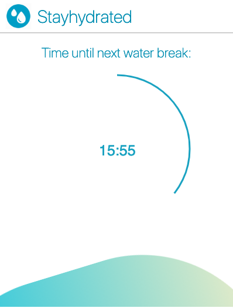

# StayHydrated

StayHydrated is a simple chrome extension that reminds the user to take a sip of water at a regular interval. 

## Features

- Scheduled automatic timers
- Desktop and tab notifications
- Open source software

## Screenshots

## License

This project is licensed under the MIT License - see the [LICENSE.md](LICENSE.md) file for details

